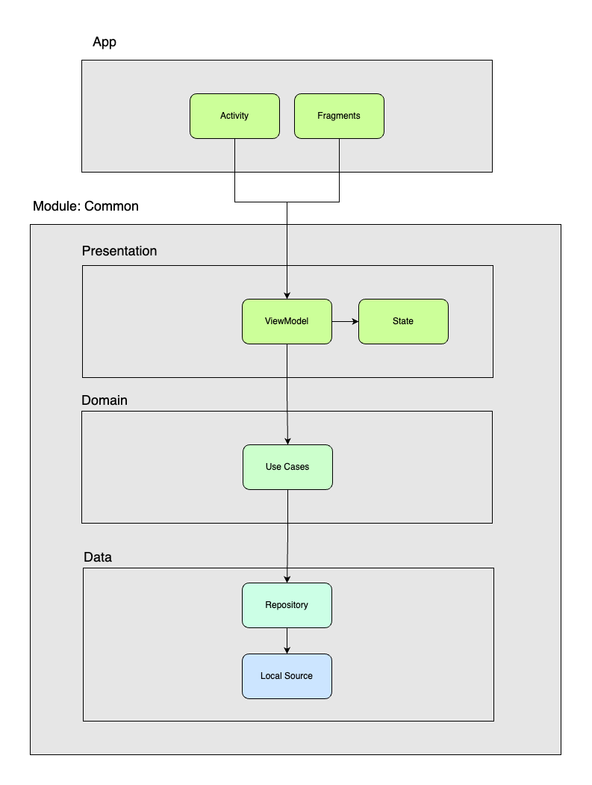

# Android Betsson group Interview

In its implementation, the architecture standards MVVM + Clean Architecture were used

### App architecture representation:

### Architecture Patterns used:

- MVVM Pattern
- Clean Architecture

### Technologies used:

- Koin (Dependency Injection)
- Coroutines
- Flow
- Shimmer
- Coil(Image Loader)
- Mockk

